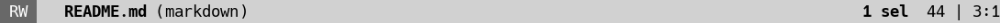
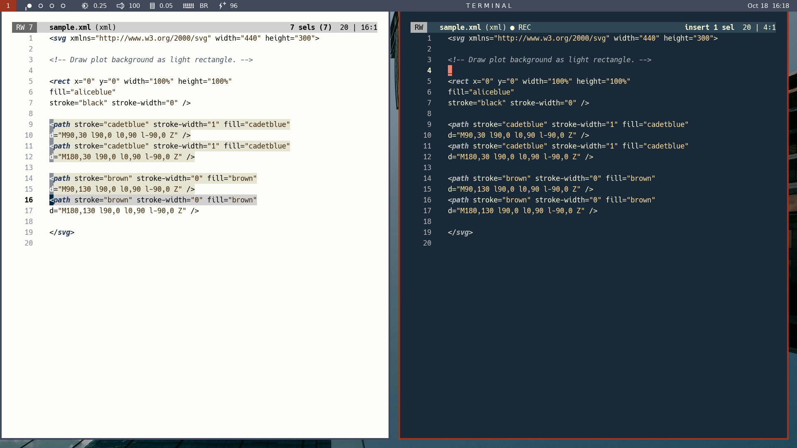

# nanoline.kak

Nanoline is a Kakoune modeline inspired by
[Nano Emacs](https://github.com/rougier/nano-emacs).

# Permanent components

Whereas Kakoune's modeline aligns its whole content to the right, nanoline aligns
some permanent components to the left and some permanent components to the right:

The permanent components on the left are:

* an indicator stating whether the buffer is open in read-write mode (RW) or is
read-only (RO).
* the buffer name in boldface.
* the filetype in parentheses.

Together, these left-aligned components form the **head**.

The permanent components on the right include information about the current
mode and selections, the number of lines in the buffer, and cursor position.
Together, these right-aligned components form the **tail**.

# Temporary components

Nanoline also displays temporary components alongside the head:

- the **number of selections** when there is more than one.
- a **macro indicator** when a macro is being recorded.

The following screenshot shows nanoline running atop a light colorscheme (on the left)
and a dark colorscheme (on the right).

On the left, Kakoune runs in Normal mode and with 7 selections. Notice the number
7 visible along the read-write indicator.

On the right, Kakoune runs in Insert mode and while recording a macro. Notice
the "● REC" indicator visible to the right of the filetype.

# How it works

Nanoline does not replace Kakoune's modeline. Instead, nanoline echoes its head over
the left side of the default modeline, whose right-aligned components remain visible
as tail. The head must be refreshed constantly, because buffer-related events such as
normal key presses and mode changes tend to clear the echo area. Nanoline relies on
[hooks](https://discuss.kakoune.com/t/hooks/544) for this purpose. To avoid the costs
of forking, no shell calls are ever made during head updating.

Nanoline can change the **format** of your modeline (i.e., which components will
be shown as tail). These changes are **optional**, however, and in any case they will
not affect the foreground and background colors of the modeline tail. These are not
nanoline's responsibility; they are the responsibility of your colorscheme.

# Installation

Download the provided [nanoline.kak](./nanoline.kak) file and put it somewhere
in your autoload directory tree.

# Configuration

Nanoline can be customized via four public options and two commands.

The options are:

* `nanoline_rw_face_dark`: the face to be used for the read-write indicator
when working with a dark colorscheme.

* `nanoline_rw_face_light`: the face to be used for the read-write indicator
when working with a light colorscheme.

* `nanoline_macro_on`: the string to display when a macro is being recorded;
i.e., the **macro indicator**. This string equals "`● REC`" by default.

* `nanoline_macro_off`: the string to display after macro recording ends. This should
be a string of consecutive blanks, long enough to cover the macro indicator fully
(thus, wiping it clean). This string equals "`     `" by default.

The commands are:

* `nanoline <light|dark>`: this command will run nanoline with the head colors
appropriate to your current colorscheme (light or dark). You are free to call this
command with different arguments (light vs. dark) across different sessions, as in
the preceding screenshot.

* `nanoline-format`: this command will make your modeline tail look like the
pictures above. If you prefer to keep your modeline format as is, then just
don't call `nanoline-format` :-).

# Related work

[yummy.kak](https://github.com/Hjagu09/yummy.kak)

